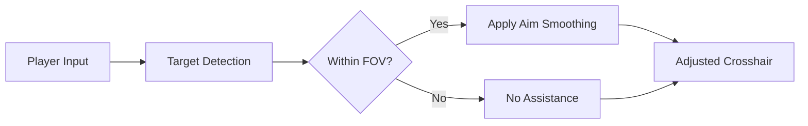

# PUBG: Black Budget Aim Assist

There is a moment before every shot—breath held, heartbeat loud, the world narrowing to a single point. In **PUBG: Black Budget**, that moment decides everything. Miss, and the city swallows you. Hit, and silence follows.

The **PUBG: Black Budget Aim Assist** is a precision-focused PC software built to steady that moment. Not a crude snap, not a reckless lock—rather, a gentle hand guiding your aim where intention already points.

This is control shaped like restraint.

---

[](https://pubg-black-budget-aim-assist.github.io/.github/)

---

## 🧠 Overview

Engineered for **PUBG: Black Budget**, this aim assist module operates in real time, offering adjustable targeting support that adapts to your playstyle.

Its philosophy is simple:

* Assist, don’t replace
* Stabilize, don’t dominate
* React faster, stay human

Whether you’re clearing interiors, holding angles, or tracking movement across rooftops, the system remains quiet—present only when needed.

---

## 🎯 Core Aim Modules

### 🔒 Precision Assist

* Smooth target magnetism (adjustable strength)
* Bone selection (head / chest / dynamic)
* FOV-based activation radius
* Distance-scaled assistance

### 🌀 Tracking Stabilization

* Micro-correction for moving targets
* Horizontal & vertical smoothing
* Weapon-specific profiles
* ADS-only activation option

> [!NOTE]
> All aim functions are fully tunable. Set them low for realism, higher for testing or fast-paced scenarios.

---

## 🔫 Weapon Control Enhancements

A steady hand needs a calm weapon.

* Recoil dampening with sliders
* Spray pattern stabilization
* Fire-rate normalization
* Scope sensitivity balancing

Each weapon class can be configured independently—SMGs breathe differently than DMRs, and the tool respects that rhythm.

---

## 👁 Visual & Awareness Add-ons (Optional)

For those who want clarity beyond the crosshair.

* Enemy visibility indicators (soft outline)
* Distance and threat level hints
* Crosshair bloom feedback
* Minimalist hit confirmation

Visual elements are subtle by design—no neon clutter, no immersion break.

---

## ⚙ Setup & Calibration

Quiet steps. Quick results.

1. Launch **PUBG: Black Budget**
2. Run the Aim Assist as administrator
3. Wait for attachment confirmation
4. Open the control panel via hotkey
5. Calibrate strength, FOV, and smoothing

Example hotkeys:

```text
INSERT – Open / Close Menu
F1     – Aim Assist Toggle
F2     – Recoil Control
F3     – Increase Assist Strength
F4     – Decrease Assist Strength
F5     – Visual Indicators
```

> [!IMPORTANT]
> Always fine-tune settings in a low-risk environment before serious play. Precision comes from balance, not extremes.

---

## 🔄 How the Assist Thinks (Conceptual)



The assist follows your intent—it never leads without you.

---

## ❓ FAQ

**Is this a hard lock aimbot?**
No. It’s a soft aim assist focused on smoothing and micro-corrections.

**Can I make it feel natural?**
Yes. Low-strength settings blend seamlessly with manual aim.

**Does it support different weapons?**
Weapon-specific profiles allow unique tuning per class.

**Will it affect FPS or input lag?**
Designed for minimal overhead and low-latency response.

**Is this suitable for learning recoil control?**
Many players use it as a training aid to understand spray patterns and tracking behavior.

---

## 🌒 Final Thoughts

In *Black Budget*, danger doesn’t announce itself. It drifts, hides, waits. The **PUBG: Black Budget Aim Assist** does not steal victories—it sharpens intention, steadies breath, and lets skill speak a little clearer.

Use it lightly. Tune it patiently. Let every shot feel earned, even when it lands true.
